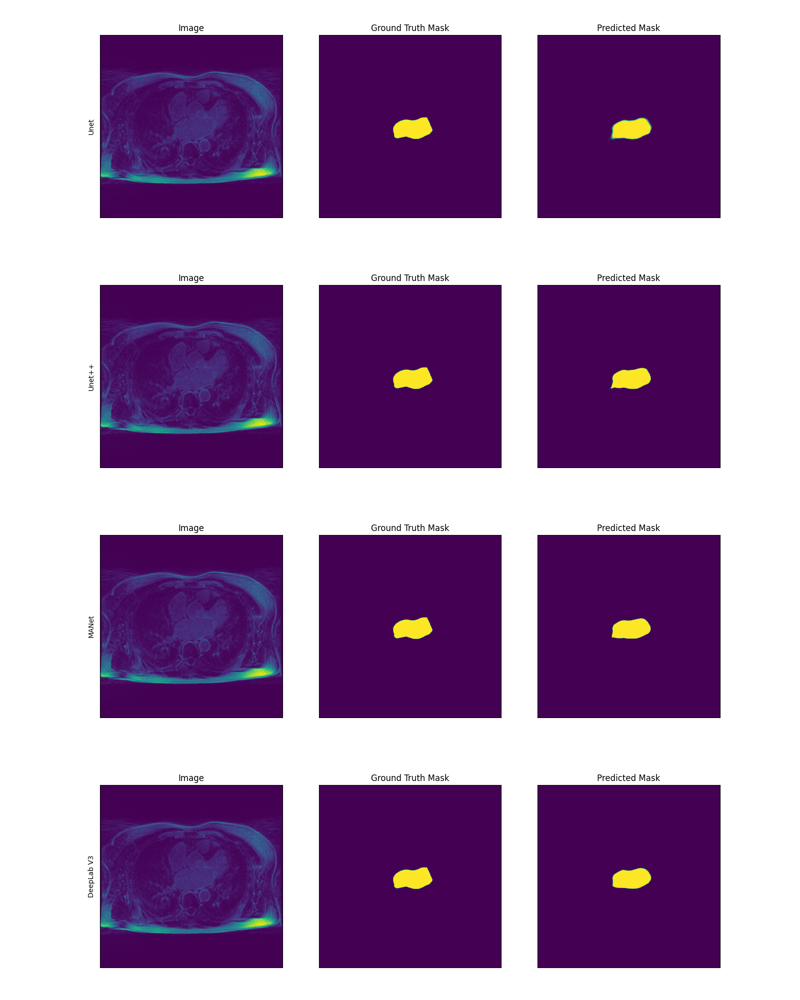

# Left_Atrium_Segmentation

Left Atrium segmentation from LGE-MRI is the initial step for diagnosing left atrial fibrosis. However, because of the varying image quality and the
different shapes of the left atrium, deep learning methods are gaining more attention on left atrium segmentation. So, we analyzed the deep learning
models that perform well on medical imaging on MICCAI 2018 left atrium segmentation challenge dataset. After evaluating different metrics, the analysis
shows that deep learning models with skip connection or self-attention-based models perform better on average in all metrics than other deep learning
architectures. Apart from that LA wall segmentation was also implemented on University of Utah's LGE-MRI dataset. This research can be reference for 
other medical imaging analysis.

## Table of Contents
* [Methods](#Methods)
* [Results](#results)
* [Setup](#setup)
* [Usage](#usage)
* [Acknowledgements](#acknowledgements)
* [Contact](#contact)

## Methods
As it is a benchmark research, for Left Atrium segmentation and wall segmentation the following methods were used:
- Unet.
- Unet++
- MAnet
- DeepLabV3

## Results

<!-- If you have screenshots you'd like to share, include them here. -->

## Acknowledgements
- This project was conducted under the supervision of Dr. Shireen Elhabian
- Pre-trained models was based on [Segmentation PyTorch Library](https://github.com/qubvel/segmentation_models.pytorch)

## Contact
Created by [@syedfahimahmed](https://syedfahimahmed.github.io/) - feel free to contact me!